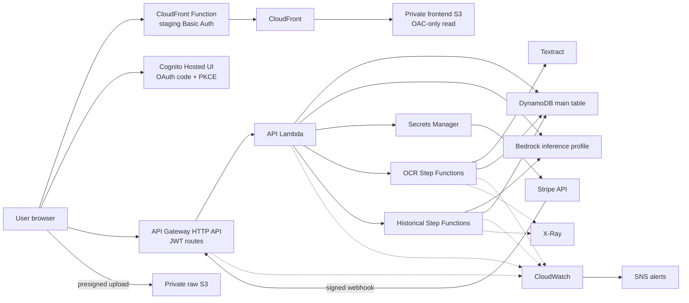
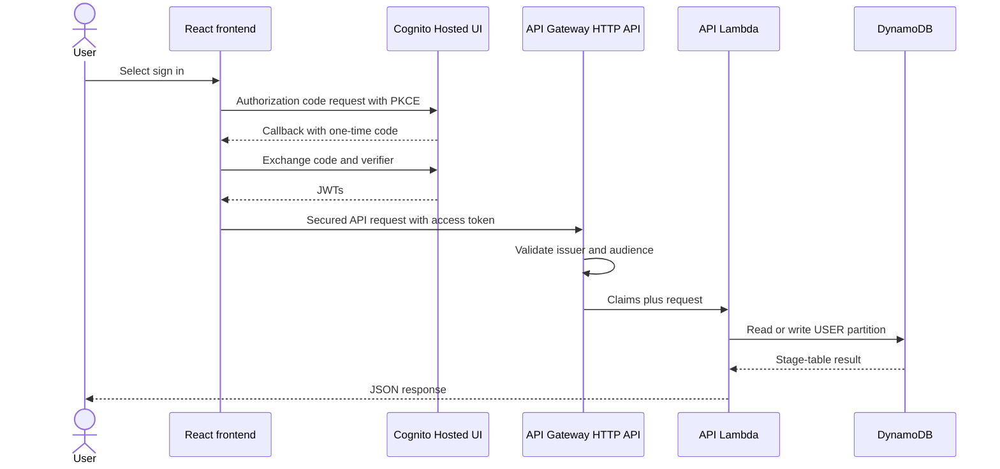
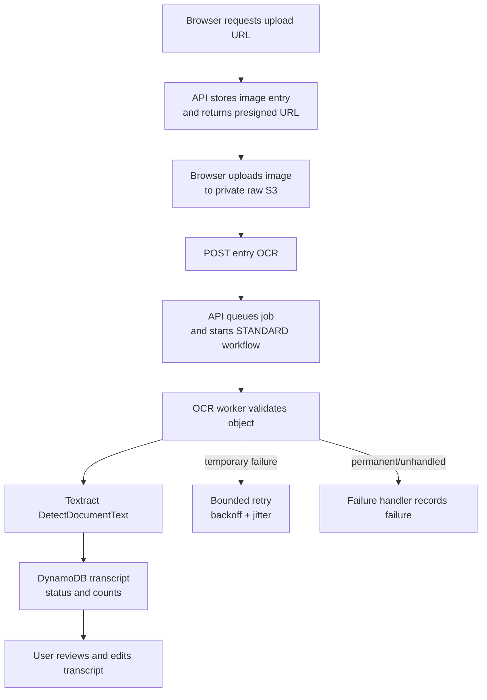
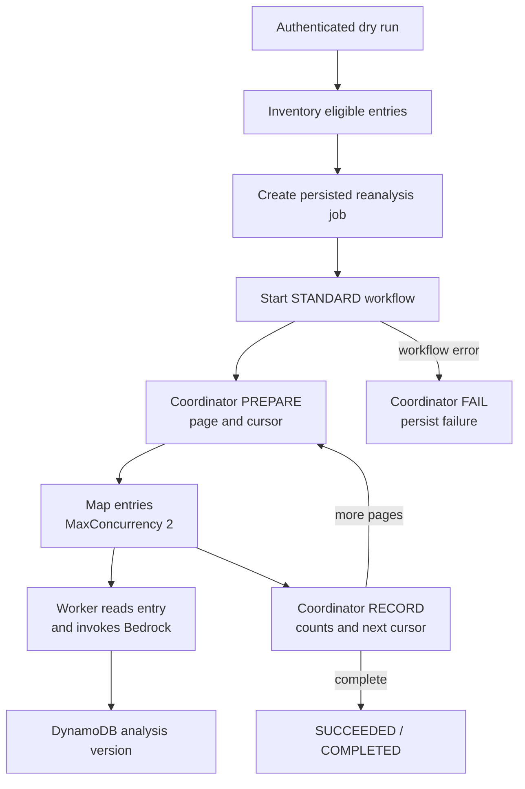
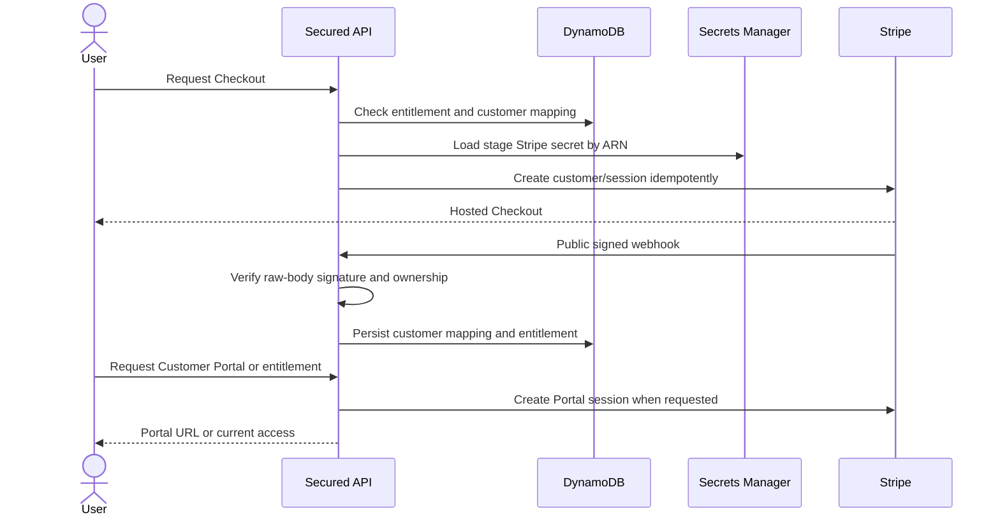
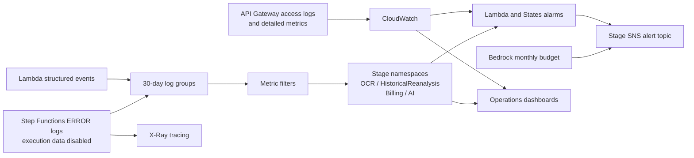

# JM8 Cloud Architecture

This document explains the implemented JM8 architecture, the staging deployment that has been accepted, and the production work that remains. It uses three evidence labels:

- **Repository-backed** means the behavior is present in the checked-in scripts, templates, or application code.
- **Verified in staging** means the staging acceptance evidence supplied with this documentation confirmed the behavior.
- **Recommendation** means the capability is not implemented and must not be treated as current state.

Production has not been deployed. The repository currently rejects `STAGE=prod`, and the frontend hosting scripts are staging-only.

## 1. High-level view

JM8 turns typed or photographed journal entries into private, searchable reflection data. A user can sign in, create or upload an entry, run OCR on a journal image, correct the transcript, request Bedrock analysis, explore trends and reports, ask questions over their journal history, and manage a paid Pro subscription. An authenticated user can also run a controlled reanalysis of eligible older entries after an analysis schema or prompt changes.

The main user journeys are:

1. **Journal:** authenticate, create or upload an entry, then read or delete it.
2. **Image-to-text:** upload privately to S3, run the OCR workflow, review the extracted text, then analyze it.
3. **Insight:** analyze an entry with Bedrock, inspect analysis history, trends, reports, and Ask JM8 history.
4. **Historical upgrade:** preview eligible entries, submit a bounded reanalysis job, and inspect job results.
5. **Billing:** start Stripe Checkout, receive a verified webhook, persist entitlement state, and open Customer Portal.

The architecture is serverless because request handling, workflow orchestration, data storage, static delivery, authentication, and observability use managed AWS services without long-running application servers. Lambda and DynamoDB scale with demand; Step Functions provides durable background orchestration; CloudFront serves the frontend near users. For the business, that keeps idle infrastructure cost low and lets a small team operate the product. The tradeoff is greater dependence on service quotas, IAM correctness, eventual consistency, cold starts, and disciplined observability.

### Overall request architecture

**Verified in staging:** private S3 plus CloudFront OAC hosting, staging Basic Auth, Cognito and JWT authorization, secured API routes with a public Stripe webhook, hardened data stores, Stripe test lifecycle, manual Bedrock analysis, OCR/historical workflow logging and tracing, one-record historical execution, dashboards, alarms, retention, and SNS delivery all passed acceptance.

## 2. Medium-level components

### Frontend delivery

`backend/infra/cloudfront/frontend-hosting.yaml` defines the staging frontend stack `${APP_NAME}-${STAGE}-frontend-hosting`:

- a dedicated `${APP_NAME}-${STAGE}-frontend-${EXPECTED_AWS_ACCOUNT_ID}` S3 bucket;
- S3 Public Access Block, bucket-owner-enforced ownership, AES-256 server-side encryption, versioning, and lifecycle rules;
- a CloudFront Origin Access Control that signs S3 requests with SigV4;
- a CloudFront Function that compares a digest of staging Basic Auth input at viewer request time;
- HTTPS redirects, compression, HTTP/2 and HTTP/3, the AWS managed caching-optimized policy, and SPA fallbacks for S3 403/404 responses;
- the CloudFront default certificate, not a custom domain or ACM certificate.

`backend/bin/create-frontend-hosting` creates or updates and then verifies the CloudFormation stack. `backend/bin/deploy-frontend` runs frontend tests, builds staging, syncs files, assigns immutable one-year cache metadata only to hashed assets, assigns no-cache metadata to other files and no-store metadata to `index.html`, invalidates `/*`, waits with the valid `invalidation-completed` waiter, and checks unauthenticated and authenticated responses.

The frontend bucket is not an S3 website endpoint. CloudFront is the only intended read path. **Recommendation:** production needs a separately designed hosting path because both frontend scripts currently enforce `STAGE=staging`.

### Authentication and authorization

`backend/bin/create-auth` creates or resolves:

- Cognito user pool `${APP_NAME}-${STAGE}-users`;
- public app client `${APP_NAME}-${STAGE}-web` with no client secret;
- a stage/account-derived Hosted UI domain;
- OAuth authorization-code flow with PKCE and `openid`, `email`, and `profile` scopes.

It writes the non-secret identifiers and URLs to the ignored, mode-0600 file `backend/infra/environments/generated/${STAGE}.cognito.env`. The React frontend initiates PKCE, exchanges the callback code, and keeps tokens in browser local storage. API Gateway validates issuer and audience through a JWT authorizer. The Lambda uses the validated `sub` claim as the user ID; its `x-user-id` fallback exists for local/direct invocation but is not an authorization mechanism.

`backend/bin/secure-api` makes `POST /billing/webhook` public and requires the Cognito JWT authorizer on every other declared route.

### Cognito/API request flow

### API and Lambda

`backend/bin/deploy` packages `backend/function/*.py` and creates or updates `${APP_NAME}-${STAGE}-api` on Python 3.12/arm64 with a 28-second timeout and 512 MB memory. It requires both state machines and the Stripe secret reference to exist before the Lambda write. It also reconciles the stage-specific Bedrock inline policy before creating or updating the function.

`backend/bin/create-api` creates an API Gateway HTTP API named `${APP_NAME}-${STAGE}-api`, a Lambda proxy integration using payload format 2.0, a `$default` auto-deploy stage, explicit CORS, route postconditions, API access logs, detailed route metrics, and Lambda invoke permission. The integration timeout is 30 seconds while the Lambda timeout is 28 seconds, allowing Lambda to fail before the gateway deadline.

Route families include entries and uploads, OCR jobs, manual analysis and history, usage and entitlement, insights and Ask JM8 history, reports, historical reanalysis, Checkout, Portal, and the webhook.

### DynamoDB and raw S3

`backend/bin/create-resources` creates the on-demand `${APP_NAME}-${STAGE}-main` table with `PK`/`SK` and `GSI1PK`/`GSI1SK`. It enables point-in-time recovery and deletion protection. The application uses a single-table pattern: journal entries, usage, entitlement, billing-customer mappings, Ask history, and workflow jobs share user-owned partitions and typed sort keys.

The same script creates `${APP_NAME}-${STAGE}-raw-${EXPECTED_AWS_ACCOUNT_ID}` and enforces encryption, versioning, public-access blocking, HTTPS-only access, CORS from the validated origin set, sensitive-data tags, seven-day abort of incomplete multipart uploads, and 30-day expiration of noncurrent versions. Browser uploads use short-lived presigned URLs; application and worker roles access only required objects and operations.

### OCR

The OCR route queues state in DynamoDB and starts `${APP_NAME}-${STAGE}-ocr-workflow`. Its STANDARD state machine invokes `${APP_NAME}-${STAGE}-ocr-worker`; temporary worker/service failures are retried with exponential backoff and full jitter. Permanent input errors are recorded, and unhandled workflow failures invoke `${APP_NAME}-${STAGE}-ocr-failure-handler`. The worker confirms the S3 object exists, calls synchronous Textract `DetectDocumentText`, and stores the transcript and OCR metadata in DynamoDB.

### Bedrock analysis

Manual analysis runs in the API Lambda through `llm_journal_analyzer.py`. `backend/bin/jm8_bedrock_analysis_policy.py`, called through the shared shell helper, resolves the configured inference profile and generates exact least-privilege access:

- `bedrock:GetInferenceProfile` on the exact profile ARN;
- `bedrock:InvokeModel` on that profile ARN;
- `bedrock:InvokeModel` on its exact foundation-model destination ARNs, conditioned on the same inference-profile ARN.

The generated policy rejects wildcard actions, wildcard resources, wrong-account customer profiles, malformed ARNs, missing destinations, and applied-policy mismatch. `backend/bin/deploy` reconciles `${APP_NAME}-${STAGE}-bedrock-analysis` on only `${APP_NAME}-${STAGE}-lambda-basic-role` before the API Lambda write. Historical reanalysis has a separately generated equivalent resource policy on its worker role.

Analysis schema and prompt versions are stored in the Lambda environment alongside the inference-profile identifier. Analysis results preserve version history in DynamoDB. Logs emit operational metadata such as outcome, latency, token counts, and retry count; journal text and model responses are not intended as observability payloads.

### Historical reanalysis

The authenticated dry-run endpoint inventories eligible entries without starting a state machine. Creating a job persists job state and starts `${APP_NAME}-${STAGE}-historical-reanalysis-workflow`. The STANDARD workflow pages through eligible entries, processes a page with `MaxConcurrency: 2`, records the page, advances its cursor, and succeeds or records a workflow-level failure.

Worker outcomes are `COMPLETED`, `FAILED`, or `SKIPPED`; an individual normalized worker failure does not crash the entire map. Lambda infrastructure errors receive bounded Step Functions retries. The deployment also caps workflow concurrency at two and attempts reserved worker concurrency of two, falling back to workflow-only enforcement if the account lacks unreserved capacity.

The deployment retries a state-machine create/update only for the exact known IAM log-destination propagation error, with waits of 5, 10, 20, and 30 seconds. All other AWS errors fail immediately.

### Stripe billing and entitlement

`backend/bin/setup-stripe-catalog` idempotently resolves or creates the JM8 Pro monthly test/live catalog for the selected stage and writes only safe catalog identifiers and return URLs to the ignored generated Stripe file. `backend/bin/provision-stripe-secret` creates or updates `${APP_NAME}/${STAGE}/stripe` in Secrets Manager and writes only its ARN to the generated file. The API Lambda receives the ARN and safe catalog configuration, never the plaintext credential.

At runtime, the secret loader fetches the Stripe values from Secrets Manager and caches the result in-process for 300 seconds. Checkout creates or resolves a customer mapping and a subscription Checkout Session. The public webhook verifies the signature against the original request bytes, checks the private JM8 user reference, resolves the reverse customer mapping, and conditionally writes the user's Pro entitlement. Customer Portal uses the stored mapping. Subscription create/update/delete events reconcile access status and cancellation state.

### Observability and alerting

`backend/bin/create-api` configures structured API Gateway access logs and detailed metrics. `backend/bin/deploy-observability` sets 30-day retention for API, worker, coordinator, failure-handler, analysis, and API access log groups; creates log-derived OCR, historical, and billing metrics; creates AWS/Lambda and AWS/States alarms; builds `${APP_NAME}-${STAGE}-operations`; and routes alarms through `${APP_NAME}-${STAGE}-alerts`.

`backend/bin/deploy-analysis-observability` creates analysis outcome, token, latency, and SDK-retry metrics in `JM8/${STAGE}/AI`, two analysis alarms, and `${APP_NAME}-${STAGE}-ai-operations`. `backend/bin/deploy-bedrock-budget` creates `${APP_NAME}-${STAGE}-bedrock-monthly`, defaulting to USD 10 per month, with actual-spend notifications above 50%, 80%, and 100% through the same SNS topic.

`backend/bin/deploy-semantic-observability` creates the separate `${APP_NAME}-${STAGE}-semantic-pipeline` dashboard. It visualizes semantic-memory and embedding throughput, record success percentage, Lambda duration, stream backlog, DLQ depth, classified embedding failures, Bedrock request health and token volume, account-wide delayed Bedrock estimated charges, and EntryChunks activity. Its inventory counts come from DynamoDB `DescribeTable` and are labeled as approximate; the dashboard never scans journal or log content and does not claim that base-table and vector-index item counts form an exact coverage ratio.

Custom namespaces are stage-isolated:

- `JM8/${STAGE}/OCR`
- `JM8/${STAGE}/HistoricalReanalysis`
- `JM8/${STAGE}/Billing`
- `JM8/${STAGE}/AI`

Both state machines use stage-specific `/aws/vendedlogs/states/...` log groups with 30-day retention, logging level `ERROR`, `includeExecutionData=false`, one canonical destination ARN ending in exactly one `:*`, and X-Ray tracing enabled. **Verified in staging:** alarms transitioned, email was delivered through SNS, and alarms recovered to `OK`.

### Deployment and isolation

Names are derived from `${APP_NAME}-${STAGE}` and account-scoped S3 names. The shared environment guard validates application name, stage, AWS profile/region, STS account, resource-name patterns, origin URLs, stage-specific Stripe mode, and confirmation. Staging requires `DEPLOY_CONFIRMATION=staging`. The current code explicitly blocks production because no separate production account is configured.

Most mutating scripts call the shared guard. `backend/bin/secure-api` is the exception: it requires explicit API and Cognito values but does not call the shared account/stage guard. Operators must therefore run it only in the already verified shell immediately after guarded `create-api`, then inspect every route postcondition.

Generated Cognito and Stripe files are stage-specific, mode 0600, and ignored by Git. Frontend local environment files, `backend/.env`, `.build`, `dist`, and generated stage files are also ignored. They are local handoff artifacts, not a source of truth or a secret store.

## 3. Low-level contracts

### Request paths and trust boundaries

| Boundary | Implemented path | Security property |
| --- | --- | --- |
| Browser to frontend | HTTPS CloudFront to private S3 through OAC | Staging viewer request also requires Basic Auth; S3 public access is blocked |
| Browser to Cognito | Hosted UI authorization code with PKCE | Public client has no client secret; callback/logout URLs are stage-specific |
| Browser to API | API Gateway HTTP API to Lambda proxy | All declared routes use JWT except `POST /billing/webhook` |
| Browser to raw S3 | API-generated presigned URL | Bucket is private; object namespace is user-oriented |
| API to AWS data/services | API execution role | Stage table/bucket, exact state machines, exact secret, and exact Bedrock resources |
| Step Functions to workers | Dedicated state-machine roles | Lambda invoke is scoped to exact worker ARNs; log delivery and X-Ray use required service-level resources |
| Stripe to API | Public webhook route | Authenticity comes from raw-body signature verification, not JWT |

### IAM role relationships

| Principal role | Assumed by | Repository-backed access |
| --- | --- | --- |
| `${APP_NAME}-${STAGE}-lambda-basic-role` | API Lambda | Basic logging; scoped DynamoDB and raw S3; Textract; exact OCR/historical `states:StartExecution`; exact Stripe secret read; exact Bedrock profile/destinations; table batch write |
| `${APP_NAME}-${STAGE}-ocr-worker-role` | OCR worker Lambda | Basic logging; scoped table/index read/update; raw `users/*` read; Textract detection |
| `${APP_NAME}-${STAGE}-step-functions-role` | OCR Step Functions | Invoke exact OCR worker/failure handler; CloudWatch delivery; X-Ray actions |
| `${APP_NAME}-${STAGE}-historical-reanalysis-worker-role` | Historical worker Lambda | Basic logging; scoped table read/write; exact Bedrock profile and conditioned destinations |
| `${APP_NAME}-${STAGE}-historical-reanalysis-coordinator-role` | Historical coordinator Lambda | Basic logging; scoped table/index reads and table job-state writes |
| `${APP_NAME}-${STAGE}-historical-reanalysis-step-role` | Historical Step Functions | Invoke exact historical worker/coordinator; CloudWatch delivery; X-Ray actions |

The CloudWatch log-delivery and X-Ray statements use `Resource: "*"` because those integration actions do not support resource-level authorization. This is not a wildcard action. Textract detection also uses a service-required wildcard resource. Other resources are narrowed to stage/account ARNs or bucket prefixes.

### Environment-variable contracts

| Scope | Required examples | Purpose |
| --- | --- | --- |
| Shared deployment identity | `APP_NAME`, `STAGE`, `AWS_PROFILE`, `AWS_REGION`, `EXPECTED_AWS_ACCOUNT_ID`, `DEPLOY_CONFIRMATION` | Prevent wrong-app, wrong-stage, and wrong-account writes |
| Data and origin | `TABLE_NAME`, `RAW_BUCKET`, `ALLOWED_ORIGINS` | Enforce exact resource names and non-dev HTTPS origins |
| API runtime | workflow ARNs, Bedrock model/profile ID, analysis versions, usage limits, Stripe secret ARN, price ID, return URLs | Generated by `backend/bin/deploy` into a mode-0600 JSON file and applied to Lambda |
| Cognito | pool ID, client ID, domain, issuer, callback/logout URLs | Generated by `backend/bin/create-auth`; sourced before API security/frontend deployment |
| Frontend build | `VITE_API_ENDPOINT`, `VITE_APP_STAGE`, Cognito domain/client/redirect/logout | Compile-time Vite contract; never put server secrets here |
| Staging hosting | frontend bucket/distribution/origin and Basic Auth inputs | Required only by current staging-only hosting scripts |

`backend/bin/deploy` deliberately rejects a plaintext Stripe key in its caller environment and excludes both Stripe secret values from the Lambda environment. The standalone Stripe setup commands temporarily require the API credential in the operator process; it must be injected only for those commands and unset immediately afterward.

### Generated configuration

| File | Writer | Expected contents | Handling |
| --- | --- | --- | --- |
| `backend/infra/environments/generated/${STAGE}.cognito.env` | `backend/bin/create-auth` | Cognito identifiers and URLs | Stage-specific, 0600, ignored |
| `backend/infra/environments/generated/${STAGE}.stripe.env` | both Stripe setup scripts | Catalog writes safe price/return values; secret provisioning writes the secret ARN | Stage-specific, 0600, ignored; source after the base file |
| `frontend/.env.${STAGE}.local` | operator, not a backend script | Public Vite build configuration | Ignored; never include server secrets |

The two Stripe scripts currently share one output path. Secret provisioning rewrites that file with the secret ARN. Operators must keep the already loaded safe catalog variables in the current shell, or restore the safe values before a later deployment. This is repository-backed current behavior, not a recommendation.

### Logging, tracing, caching, and secret retrieval

- Lambda log groups follow `/aws/lambda/${function-name}`; API access logs use `/aws/apigateway/${APP_NAME}-${STAGE}-api`.
- Workflow log groups are `/aws/vendedlogs/states/${APP_NAME}-${STAGE}-ocr-workflow` and `/aws/vendedlogs/states/${APP_NAME}-${STAGE}-historical-reanalysis-workflow`.
- Observability deployment sets the named Lambda/API log groups to 30 days. Each workflow deployment independently sets its workflow log group to 30 days.
- State-machine execution payloads are not logged; only `ERROR` workflow logs are delivered. X-Ray traces orchestration boundaries.
- CloudFront caches hashed assets for one year as immutable. `index.html` is no-store; the remaining sync is no-cache. Each deployment invalidates all paths.
- Stripe secrets are retrieved by ARN from Secrets Manager and cached per warm Lambda environment for five minutes. There is no secret in frontend configuration.

### Failure and retry boundaries

| Area | Retry behavior | Fail-closed boundary |
| --- | --- | --- |
| API request | Client may retry only responses explicitly marked retryable | Validation, ownership, entitlement, and configuration errors are not silently retried |
| Bedrock SDK | Botocore reports retry attempts; analyzer classifies invocation vs response/input failures | Invalid model response and input failures do not become success |
| OCR workflow | OCR temporary errors: up to 3 attempts, starting at 2 seconds, exponential backoff, full jitter; Lambda service errors: 2 attempts | Permanent S3/Textract input failures are recorded; terminal workflow error invokes failure handler |
| Historical workflow | Lambda service errors: 2 attempts, starting at 2 seconds, exponential backoff, full jitter | Individual results normalize to completed/failed/skipped; workflow errors persist job failure |
| Historical deployment | Only the exact IAM log-destination propagation denial is retried over 5 attempts and 65 seconds total wait | Generic access, credential, validation, network, and other AWS failures return immediately |
| Stripe secret | Retryable AWS secret-read failures are classified; successful values cache for 300 seconds | Malformed ARN/value and wrong configuration fail without exposing the secret |
| Stripe webhook | Provider delivery can be replayed; DynamoDB entitlement conflicts retry three times | Signature, event ownership, mode, and mapping mismatch are rejected |
| Deployment | Scripts are mostly idempotent create/update and verify postconditions | Shared environment validation and explicit postcondition checks stop on mismatch |

## 4. Why these AWS services

| Service | Why selected for JM8 | Main tradeoff |
| --- | --- | --- |
| CloudFront | HTTPS edge delivery, compression, cache control, SPA fallback, OAC, and a staging viewer-request gate | Global propagation/invalidation latency; custom-domain certificate and TLS policy still need production design |
| S3 | Durable, inexpensive static assets and private image objects; presigned browser upload avoids proxying binaries through Lambda | Object-store semantics, CORS/policy complexity, and lifecycle/restore procedures |
| Cognito | Managed user pool, Hosted UI, JWT issuer, and PKCE support without operating an identity server | Hosted UI/customization limits and callback/client lifecycle management |
| API Gateway HTTP API | Lower-cost Lambda proxy API with JWT authorizers, CORS, access logging, and auto-deploy | Fewer features than REST API and a hard integration-duration boundary |
| Lambda | Pay-per-use Python request and worker compute with isolated roles | Cold starts, deployment-package limits, concurrency quotas, and 15-minute maximum runtime |
| DynamoDB | On-demand, low-operations single-table storage with conditional writes, transactions, GSI, PITR, and deletion protection | Access patterns must be designed up front; ad hoc querying and relational joins are weak |
| Step Functions | Durable STANDARD workflows, visual execution state, retries/catches, maps, logging, and tracing | State-transition cost and more IAM/configuration surfaces than an in-process job loop |
| Bedrock | Managed model access through a governed inference profile with usage metadata | Regional/model availability, variable latency/cost, and model-output validation requirements |
| Textract | Managed OCR for images already stored in S3 | Per-page cost and imperfect handwriting extraction require user review |
| Secrets Manager | Encrypted runtime retrieval, ARN-scoped IAM, and separation from Lambda/frontend configuration | Per-secret/API-call cost and cache/rotation behavior must be managed |
| CloudWatch | Native logs, metrics, metric filters, alarms, dashboards, and API/States integration | Metric-filter delay, custom-metric cost, and log discipline are operational responsibilities |
| X-Ray | Workflow-level trace correlation without logging execution data | Sampling and trace coverage do not replace application metrics/logs |
| SNS | One stage-specific fan-out target for alarms and budgets | Email subscriptions require manual confirmation and delivery is notification, not incident management |

## 5. How to explain JM8 in an interview

### 30-second version

“JM8 is a serverless journaling intelligence platform on AWS. A private React frontend uses Cognito PKCE and an API Gateway JWT authorizer to reach Python Lambda. DynamoDB stores user-owned journal, analysis, usage, and entitlement records; private S3 stores uploaded images. Step Functions makes OCR with Textract and historical Bedrock reanalysis durable and bounded. Stripe billing uses Secrets Manager and signed webhooks, while stage-isolated CloudWatch metrics, alarms, dashboards, X-Ray, and SNS make the system operable.”

### 2-minute version

Start with the user path: CloudFront serves a React SPA from an OAC-protected S3 bucket. Cognito performs authorization-code plus PKCE login, and API Gateway rejects invalid issuer/audience JWTs before invoking Lambda. The API Lambda owns synchronous entry, insight, usage, and billing routes and uses the Cognito subject as the tenant key.

Images upload directly through presigned URLs to a different private S3 bucket. OCR is asynchronous: the API persists a pending job, Step Functions invokes an OCR worker, the worker validates the object and calls Textract, and a failure handler persists terminal errors. Historical analysis is another STANDARD state machine with page checkpoints and map concurrency of two, so model cost and table pressure are controlled.

Bedrock permissions are generated from the exact inference profile and destination models; Stripe credentials are fetched from Secrets Manager by ARN and never shipped to the browser or Lambda environment. DynamoDB uses on-demand capacity, conditional writes, PITR, and deletion protection. Every stage has distinct names and custom metric namespaces. CloudWatch converts structured events into business/operational metrics, sends alarms and Bedrock budget thresholds to SNS, and retains operational logs for 30 days. Staging has been accepted; production remains gated on a separate account and a production hosting/domain design.

### Senior cloud engineer / solutions architect version

Frame the design around trust boundaries and failure containment:

- **Identity before compute:** API Gateway validates Cognito issuer/audience; the Lambda derives tenancy from the `sub` claim. The sole public business route is the Stripe webhook, secured at the message layer by raw-body signature and ownership checks.
- **Least privilege by workload:** API, OCR, historical worker, coordinator, and state machines have distinct roles. Bedrock resources are derived and verified from the inference profile. State roles invoke exact Lambda ARNs. Wildcard resources are confined to AWS APIs that do not support resource scoping.
- **Durability where latency exceeds a request:** API work stays below its 28-second timeout; OCR and reanalysis move to STANDARD workflows with explicit retry/catch policy and persistent job state.
- **Backpressure and cost control:** DynamoDB is on-demand, historical map concurrency is two, reserved worker concurrency is attempted, analysis metrics expose token use, and a Bedrock budget alerts at three thresholds.
- **Data protection:** both buckets are private, encrypted, versioned, HTTPS-only, and lifecycle-managed; the table has PITR and deletion protection; secrets stay in Secrets Manager.
- **Operability:** structured application events feed stage-specific metrics and alarms; API access logs, workflow ERROR logs without execution payloads, X-Ray, dashboards, and SNS cover request, workflow, model, billing, and cost signals.
- **Known gaps:** the current production guard intentionally fails, frontend automation is staging-only, the template uses the CloudFront default certificate, and backup restoration/load/security/privacy evidence must be completed before go-live.

### Key decisions and tradeoffs

- A single API Lambda simplifies deployment and shared business rules, but its IAM and blast radius need continued review as route count grows.
- Single-table DynamoDB makes tenant timelines and related records fast and serverless, but migrations and cross-tenant analytics are deliberately harder.
- Direct S3 upload avoids API binary bottlenecks, but moves upload/CORS state coordination to the browser and API.
- Two state machines isolate OCR from historical analysis and give each independent roles, concurrency, metrics, and failure behavior, at the cost of more deployment code.
- Inference profiles allow exact Bedrock governance across destination models, but IAM must be reconciled before Lambda updates and can be subject to propagation delay.
- Staging Basic Auth limits casual exposure before Cognito, but it is not a production identity layer and requires an explicit production decision.

### Reliability, security, scalability, cost, and observability talking points

- **Reliability:** durable STANDARD workflows, bounded exponential retries, idempotent catalog/deploy operations, DynamoDB conditional updates, job checkpoints, and fail-closed postconditions.
- **Security:** JWT validation, stage/account guards, private encrypted buckets, OAC, presigned uploads, least-privilege roles, Secrets Manager, payload-free Step Functions logs, and public-webhook signature validation.
- **Scalability:** CloudFront edge caching, Lambda concurrency, on-demand DynamoDB, direct S3 data plane, and explicitly bounded reanalysis concurrency.
- **Cost:** no idle servers, immutable frontend caching, on-demand data/compute, concurrency caps, token metrics, 30-day logs, S3 lifecycle, and Bedrock budget thresholds.
- **Observability:** structured log events, API access logs, native Lambda/States metrics, stage-isolated custom namespaces, dashboards, alarms, X-Ray, SNS delivery, and verified alarm recovery.

## 6. Evidence map and current-state caveats

Primary repository evidence inspected for this document:

- deployment and guard scripts under `backend/bin/`;
- workflow definitions under `backend/infra/`;
- CloudFront template `backend/infra/cloudfront/frontend-hosting.yaml`;
- environment examples and ignore rules;
- API, OCR, historical, Bedrock, Stripe, entitlement, and storage modules under `backend/function/`;
- deployment, environment, security, workflow, billing, and observability tests under `backend/tests/`;
- frontend Cognito, API, and environment contracts under `frontend/src/` and `frontend/scripts/`.

The supplied acceptance record says staging `main` and `staging` referenced commit `d988997`; the local checkout used for this documentation is `main` at the same full commit. This is evidence about the documentation baseline, not a guarantee about any remote branch after this document was written.

See the [staging operations runbook](JM8_STAGING_OPERATIONS_RUNBOOK.md) for operator commands and the [production promotion checklist](JM8_PRODUCTION_PROMOTION_CHECKLIST.md) for remaining gates.
